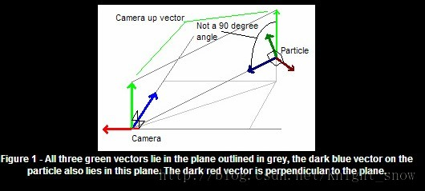

# 广告牌技术  

无论观察者处于什么位置观察任何图像,广告版都能提供一个朝向观众的面,这个面随着摄像机的改变而改变.BillBoard技术是计算机图形学领域中进行快速绘制的一种方法。在类似游戏这种对实时性要求较高的场景下采取BillBoard技术可以大大加快绘制的速度从而提高画面的流畅性。

广泛引用：渲染烟雾、云朵、闪光效果，HUD血条等，粒子特效等。相关参考文献如下：

[Billboarding-Excerpt_From_iReal-Time_Renderingi_2E](http://www.flipcode.com/archives/Billboarding-Excerpt_From_iReal-Time_Renderingi_2E.shtml)

[NeHe-billboarding](http://nehe.gamedev.net/article/billboarding_how_to/18011/)  

**实现思路**  

广告牌的本质是构建旋转矩阵，3个基向量: up, normal, right  

*normal*：意思是朝向Camera的方向,这个很容易由两个向量（Camera坐标和当前顶点的坐标）相减得到,然后归一化。

*right*：首先根据normal和camera的up向量(0,1,0)叉乘计算right： right = camup x normal

*up*：将right归一化后，根据normal和right再次叉乘计算出正交的up： up = normal x right