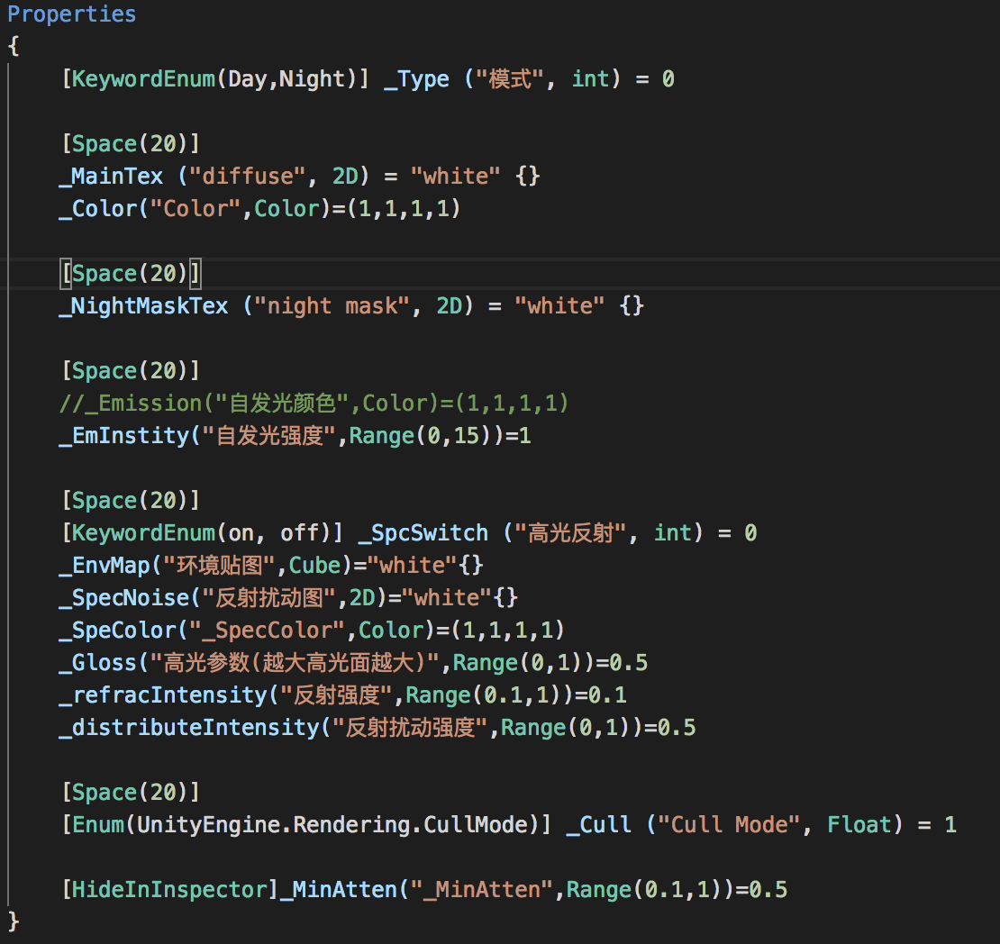
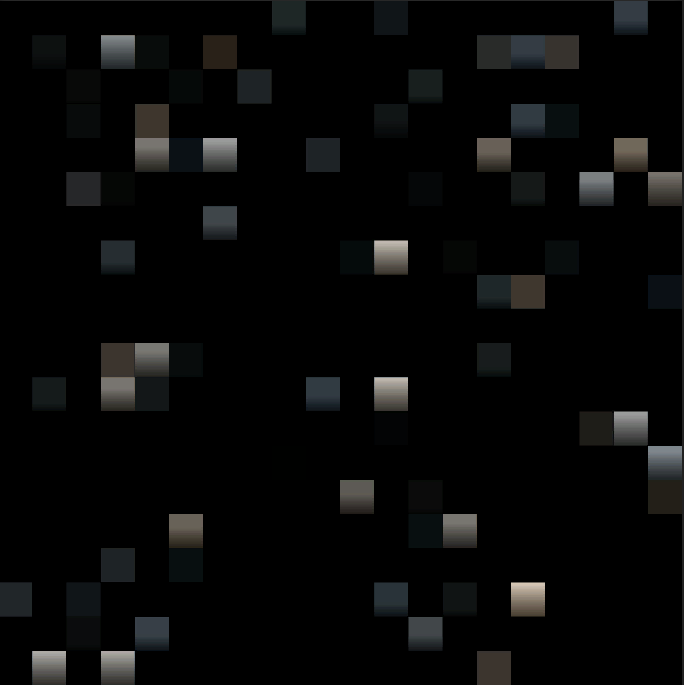

###这里记录一下，城市场景渲染，切换白天夜晚的方案。  

**参数设置，这里只说几个重要的**
  
    
**_Type** : 模式类型，用来切换白天夜晚  
**_NightMaskTex** : 表现夜晚窗户明暗的遮罩图，是一张明暗变化随机的色块，如下图：
  
就如上图，亮的地方就表示了明暗不一的窗户，暗的地方就表示家里没人。通过调整贴图的**tilling**值，可以表现出不同大小方形窗户的的夜间效果。  
**_EmInstity** : 自发光强度  
**_SpcSwitch** : 高光开关  
**_EnvMap** : 高光反射用的环境贴图  
**_SpecNoise** : 高光反射的扰动图。现实生活中我们可以看到，建筑玻璃上面的高光反射，会有一些抖动的效果。  
**_distributeIntensity** : 高光反射扰动强度  
  
  
**其他**  
```
引入系统宏 
#pragma multi_compile LIGHTMAP_OFF LIGHTMAP_ON
```
  
这个宏用来区分是否有Lightmap的，也就是场景是否被烘培。  
例如：在LIGHTMAP_ON 可以直接对lightmap进行采样即可。在LIGHTMAP_OFF 要进行实时的光照计算，最终得到渲染结果。因为这个Shader脚本要兼容烘培模式，所以引入这个宏。  

```
float2 lmuv : TEXCOORD1;//lightmap in uv1
```
unity中的烘培信息是记录在uv2中的。  

具体代码层面没必要说，都是很容易理解的普通运算。  

放几张项目运行时的截图


