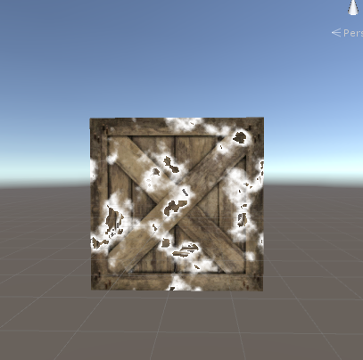

# 消融效果  

***Properties***

```
	_Progress("_Progress",Range(0,1))=0
	_DissolveColor("_DissolveColor",Color)=(1,1,1,1)
```  

**_Progress:** 溶解进度，当为0时完全溶解，为1时正常显示  
**_DissolveColor** 溶解时所显示的边缘色  

***clip剔除***  

```
	fixed4 burn=tex2D(_Noise,i.uv);

	float clipV=burn.r-_Progress;

	clip(clipV);
```  
采样噪声贴图，得到r通道的值，和 *_Progress* 相减得到溶解的效果。*clip* 函数，当值小于等于0时该像素会被剔除，后面的逻辑都不再执行。
例如：当 *_Progress* = 0时，*clipV* 的值绝对大于0，所以没有像素被剔除。当 *_Progress* = 1时，clipV的值绝对小于等于0，所有像素都会被剔除。  

***边缘色***  

```
	float t=smoothstep(0,0.2,clipV);

	col.xyz=lerp(col.xyz,_DissolveColor,1-t);

	return col;
```  
*smoothstep* 平滑函数会将大于等于0.2的部分映射为1，小于等于0的部分映射为0，中间部分做平滑差值 
噪声图采样是取随机的一种常用方式，但它里面的值是连续的，也就是说他们的值是有一定线性规律的。所以 *clipV* ***的值越接近0的部分，越就是溶解的边缘部分*** ，这里通过smoothstep的方式定义0~0.2的部分为边缘溶解色，用lerp差值的方式定义最终着色。  

  
这是 *_Progress* = 0.3 时的效果  

噪声图可以用substance disigner重新输出一张，可以得到不一样的溶解效果。