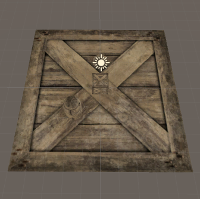
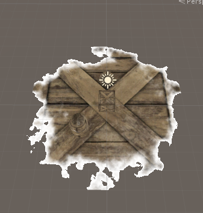

# 环境消融  

**思路**
1. 遍历每个顶点信息，找出顶点到溶解结束点的最大距离 *_MaxDistance*
2. *fragment shader* 中比较当前片元的距离比。*len* 为当前片元到溶解结束点的距离，距离比就是 *len/_MaxDistance*  
3. 根据距离比、噪声贴图采样、*_Progress* 来进行溶解操作  

****  

```
    void Start()
    {
        //计算所有子物体到消融开始点的最大距离
        //遍历所有顶点，计算出 _MaxDistance
        MeshFilter[] meshFilters = GetComponentsInChildren<MeshFilter>();
        float maxDistance = 0;
        for (int i = 0; i < meshFilters.Length; i++)
        {
            float distance = CalculateMaxDistance(meshFilters[i].mesh.vertices);
            if (distance > maxDistance)
                maxDistance = distance;
        }

        //传值到Shader
        MeshRenderer[] meshRenderers = GetComponentsInChildren<MeshRenderer>();
        for (int i = 0; i < meshRenderers.Length; i++)
        {
            meshRenderers[i].material.SetVector("_End", dissolveEndPoint);
            meshRenderers[i].material.SetFloat("_MaxDistance", maxDistance);
        }
    }
```    

```
    fixed4 frag (v2f i) : SV_Target
    {
        float len = length(_End.xyz - i.worldPos.xyz);

        //得到距离比
        float lenProgress=1-(len/_MaxDistance);//从外向内

        fixed4 col = tex2D(_MainTex, i.uv);

        fixed4 burn = tex2D(_Noise,i.uv);

        //根据距离比和_Progress 得到 disFactor
        float disFactor = lenProgress - _Progress;

        //根据噪声图采样得到 burnFactor
        float burnFactor = burn.r - _Progress;

        //插值得到 溶解效果 
        //_DistanceEffect=1时 边缘是圆形
        //_DistanceEffect=0时，有溶解，但没有根据距离比溶解 所以这里要有个插值操作
        float clipV = lerp(burnFactor, disFactor, _DistanceEffect);

        clip(clipV);//剔除 确定没有的区域	

        //smoothstep方法映射范围(0~1) t==0 溶解边界 t==1正常渲染
        float t=smoothstep(0,0.1,clipV);

        col.xyz=lerp(col.xyz,_DissolveColor,1-t);

        return col;
    }
```  
正常时效果  
  
40%溶解效果  

