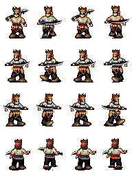

# 帧动画  

**思路**  

  

如图，整个动画片段是由16张小图动态切换而成的。所以我们应该动态的计算uv的偏移值，来让图片动起来。  

1. 先计算小图Cell的局部偏移值  
```
	//得到每个小图的采样坐标
	//一张图的采样坐标范围是【0，1】，那么每个小图的采样坐标范围就是除以行数和列数
	float2 cell=float2(uv.x/_Column,uv.y/_Row);
```  
2. 计算当前所播放动画片段的图片索引  
```
    //总数
    int count = _Row * _Column;
 
    //取余数 得到当前索引位置
    int SpriteIndex = fmod(_Time.y*_Speed,count);
 
    //Y索引位置
    int SpriteRowIndx = (SpriteIndex / _Column);
 
    //X索引位置
    int SpriteColumnIndex = fmod(SpriteIndex,_Column);

    //因uv坐标左下角为（0,0），第一行为最底下一行，为了合乎我们常理，我们转换到最上面一行为第一//行,eg:0,1,2-->2,1,0
	//索引从0开始 所以要-1
	SpriteRowIndx=_Row-SpriteRowIndx-1;
```  
3. 局部cell的偏移，加上整体的偏移，得到最终的偏移uv，进行采样即可  

```
    //乘以1.0转为浮点数,不然加号右边，整数除以整数，还是整数（有误）
    //小图的UV偏移 + 整体的UV偏移=最终UV
    uv.xy=cell+float2(SpriteColumnIndex*1.0 / _Column,SpriteRowIndx*1.0 / _Row);

    half4 c = tex2D(_MainTex,uv);
    return c;

```