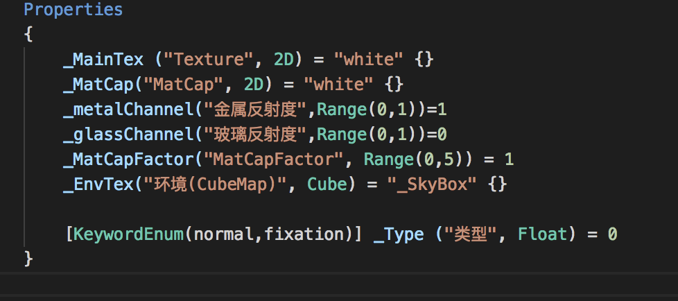
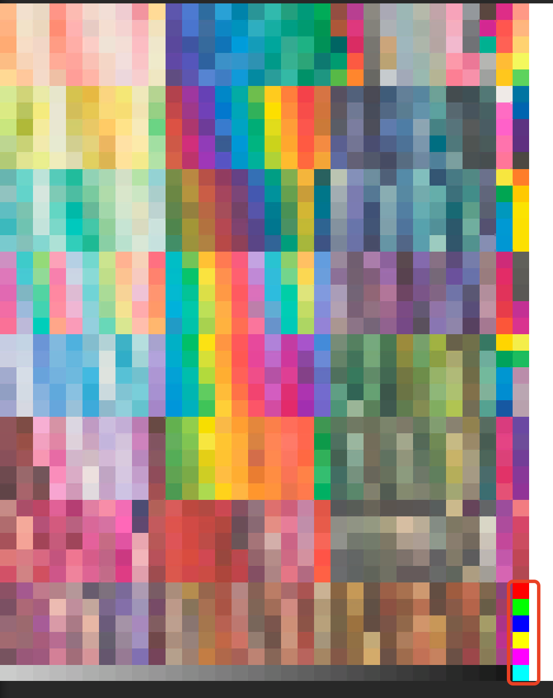
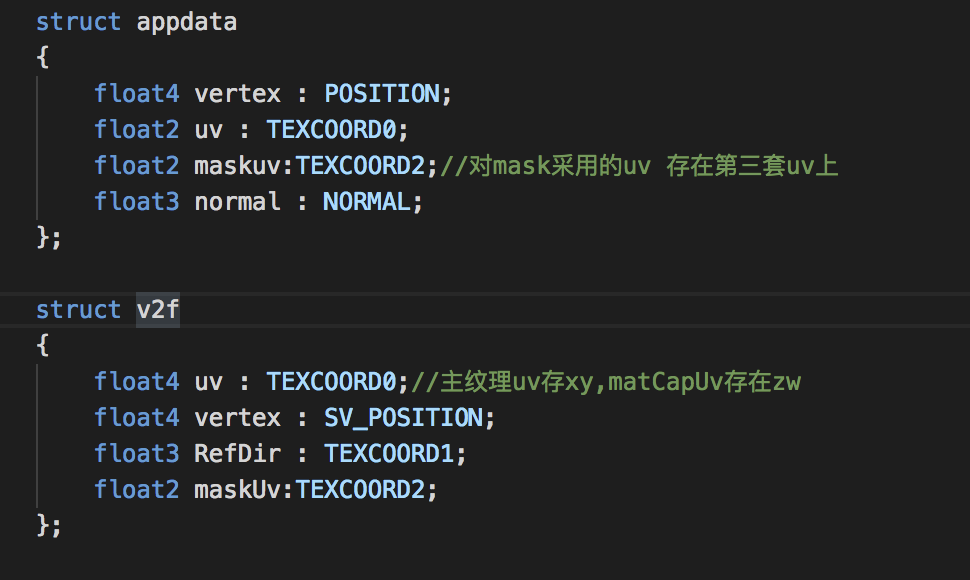

### 这个场景主要讲MaterialCapture技术的使用，在很少性能消耗的情况下，得到不错的效果，主要的思想就是预先将光照信息提前烘在一张图中，在使用时直接采样贴图，不用再进行额外的计算，以此来提高效率，这种方法在移动端有不错的表现，王者荣耀等游戏都有应用。   

  

**_MainTex** : 主贴图，但这个不是一张普通的贴图，它是张有故事的贴图。首先看起来它就是一张色卡，现在很多单风格化的项目都采用这种贴图，物体所有uv都会投射到某几个色块上，所有物体都用一张图就可以满足，缺点就是颜色单一，但足够风格化。在此之外我们还加了几个颜色遮罩来区分金属和玻璃等的材质之间的区别，如下图

   

红色标记部分，就是我们预留的遮罩色块，用来区分材质的。区分材质后可以根据不同材质进行不同的渲染操作，如车身的反射要比玻璃的反射弱一些。遮罩图的应用非常普遍，应用场景也非常多。  

**_MatCap** : 用Zbrush产出一张MatCap贴图，记录光影的明暗关系等，当然也可以根据项目的需求来产出MatCap图，如高光色，边缘色等。  

**_metalChannel** : 金属材质反射度  

**_glassChannel** : 玻璃材质反射度  

当然，反射强度这些信息同样也可以记录在MatCap的图中，用一个通道信息来拜师即可，这里暴露出来主要是为了方便美术调整参数。  

**_MatCapFactor** :  MatCap的强度

**_EnvTex** : 环境贴图cubemap，反射用的  

**_Type** : 类型切换。normal：正常视角，对MapCap采样用的uv，矩阵转换到世界坐标空间。fixation：固定视角，对MapCap采样用的uv，矩阵转换到视角空间，表现为，不论相机如何旋转，相机正对的面总是最亮的。   
  

**其他注意点**

**appdata/makuv** : 对遮罩信息的采样，采用了另外一套uv，因为uv2是为烘培预留的，所以这里采用uv3  

**v2f/RefDir** : 反射方向

