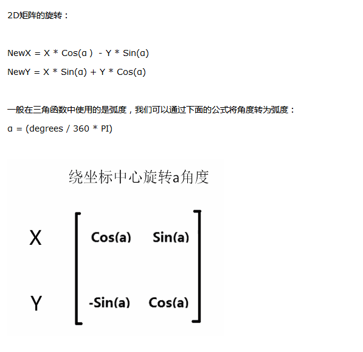

# UI Loading效果  

**参考公式**  

  

*注意：* 因为uv的原点是在左下,所以要先减去(0.5,0.5),让纹理中心点在(0,0)，这样旋转就会围着着中心进行。计算旋转完成后再将uv坐标还原即可  

```
	half4 frag(v2f i) :COLOR
	{
		//以纹理中心为旋转中心
		float2 uv = i.uv.xy - float2(0.5, 0.5);

		float angle=_RotateSpeed * _Time.y;

		float2 round=mul(twoDRoundMatrix(angle),uv);
		uv = round + float2(0.5, 0.5);				

		half4 c = tex2D(_MainTex , uv) * _Color;
		return c;
	}
```
